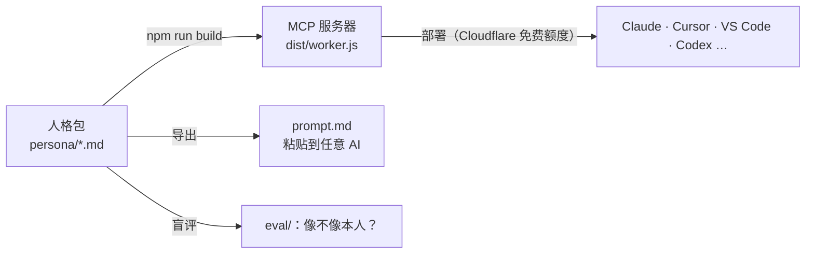

<div align="center">

# TwinKit

**把你的工作方式，做成任何 AI 都能接入的数字分身——并且量化它到底像不像你。**

[](https://github.com/chiniyaocy-dotcom/twinkit/actions/workflows/ci.yml)
[](LICENSE)


[在线体验](#30-秒体验) · [做一个你自己的](#30-分钟做出你自己的分身) · [像不像，怎么量](#像不像本人可以量化) · [English](README.en.md)

</div>

---

通用 AI 写出来的方案，往往**正确但不像你**：结构都对，话都空，取舍也不是你的取舍。

TwinKit 不做聊天机器人，也不做声音和长相的克隆。它把真正让你值钱的东西——**你怎么做决定、你的验收标准、你踩过的坑和做过的决策、你说话的样子**——整理成一个纯 Markdown 的「人格包」，部署成一个 [MCP](https://modelcontextprotocol.io) 服务器。

接上之后，Claude、Cursor、VS Code、Codex 等 AI 在动手之前会先向你的分身要一份**工作简报**，写完再按**你的标准**自检。



## 30 秒体验

演示分身「周屿」是一位**虚构的**连锁茶饮运营总监（[人格包源文件](examples/zhou-yu/)）。在 Claude Code 里：

```bash
claude mcp add --transport http zhou-yu https://twinkit-demo.2wpdmn54ks.workers.dev/mcp
```

然后说：**“用周屿的方式，写一份国庆 7 天的门店活动方案，预算 30 万。”**

再对比一下不接分身时的回答。接上之后，AI 拿到的工作简报里有周屿的原则和品味：先算“打平需要多少增量”、只选一个主目标、留对照组、坏消息先说、不写“赋能”“抓手”。

<details>
<summary>Cursor / VS Code / 其他客户端</summary>

- **Cursor**（`~/.cursor/mcp.json`）：`{"mcpServers": {"zhou-yu": {"url": "https://twinkit-demo.2wpdmn54ks.workers.dev/mcp"}}}`
- **VS Code**（`.vscode/mcp.json`）：`{"servers": {"zhou-yu": {"type": "http", "url": "https://twinkit-demo.2wpdmn54ks.workers.dev/mcp"}}}`
- **只支持 stdio 的客户端**：`npx -y mcp-remote https://twinkit-demo.2wpdmn54ks.workers.dev/mcp`
- 更多客户端见 [docs/clients.md](docs/clients.md)；用浏览器打开[演示地址](https://twinkit-demo.2wpdmn54ks.workers.dev)也能看到接入说明。

</details>

## 它和“写一段提示词”有什么不同

| | 一段自定义提示词 | TwinKit 分身 |
|---|---|---|
| 内容 | 几句“你是一个……” | 原则、禁区、交付物结构、方法、**真实决策案例**、好坏对比、语气 |
| 用法 | 每个工具各粘一份 | 一个 MCP 地址，所有支持 MCP 的 AI 通用；也能导出提示词包 |
| 按任务取用 | 全部塞进上下文 | 按任务调出最相关的方法和案例，组成工作简报 |
| 自检 | 靠模型自觉 | `review` 按你的标准检查：缺结构、越权承诺、你不说的词、没口径的数字 |
| 像不像 | 凭感觉 | 盲评实验 + 置信区间（[eval/](eval/)） |
| 边界 | 无 | 永远自称 AI；不能替你承诺、签署、审批（[安全说明](docs/safety.md)） |

## 30 分钟做出你自己的分身

需要 Node.js 18+，不需要安装任何依赖。

```bash
# 1. 点右上角 “Use this template” 新建仓库（人格包要保密的话选 Private），然后克隆下来
npm run new        # 2. 生成空白人格包 persona/
                   # 3. 填写——或者把 docs/interview-prompt.md 发给任意 AI，让它采访你 20 分钟，直接生成全部文件
npm run validate   # 4. 检查结构、漏填的占位符和隐私信息
npm run dev        # 5. 本地试用：http://127.0.0.1:8787
npm run deploy     # 6. 部署到 Cloudflare Workers（免费额度每天 10 万次请求）
```

部署细节（私有令牌模式、限流、自定义域名、不用命令行的控制台部署）见 [docs/deploy.md](docs/deploy.md)。

## 人格包长什么样

```text
persona/
├── persona.md      身份 · 决策原则 · 禁区 · 质量标准 · 交付物结构（每种交付物的固定章节）
├── profile.md      公开档案：经历、擅长、不擅长、合作方式
├── methods/        方法卡：你一贯怎么做某类事（步骤、检查点、常见坑）
├── decisions/      真实决策：情境 → 选项 → 选择 → 理由 → 结果 → 复盘
├── taste/          品味：好的样子 vs 不好的样子，以及为什么
└── voice/          表达风格：对不同的人怎么说话，什么话不说
```

全部是普通 Markdown，用任何编辑器（或 Notion / 飞书导出）都能写。格式说明：[docs/persona-spec.md](docs/persona-spec.md)。

## 分身提供什么

| MCP 能力 | 作用 |
|---|---|
| `work_brief` 工具 | 动手前调用：按任务调出相关的方法、决策案例、品味和语气，生成工作简报（含角色锁定、交付物结构、自检清单、禁区） |
| `review` 工具 | 写完后调用：检查缺失的章节、替本人承诺/审批的越权表述、你明确不用的词、没写口径的数字 |
| `find_examples` 工具 | 查找原始的方法和案例全文 |
| `get_profile` 工具 | 档案和知识库目录 |
| `work_as_twin` 提示词 | 在支持 MCP 提示词的客户端里一键“按 TA 的方式工作” |
| `twin://profile`、`twin://prompt-pack` 资源 | 档案和完整提示词包 |
| `/prompt.md` | 不支持 MCP 的 AI（ChatGPT GPTs、Kimi、豆包……）直接粘贴使用 |

所有工具都是只读的：分身只提供“怎么做”，不会替你发消息、付款或改任何东西。

## “像不像本人”可以量化

我们不想靠截图和感觉说服你，所以评测是这个项目的一等公民。

1. 写 20 个你真实会遇到的任务（[示例](eval/tasks.example.md)）。
2. `node eval/run.mjs --tasks eval/tasks.md`：同一个模型、同一批任务，生成三种回答——**只给任务** / **加一句“你是一名<你的角色>”** / **接入你的分身**（可选再加你本人的原稿）。默认使用 GitHub Models 的免费额度。
3. 把生成的 `rate.html` 发给你自己和 2 位以上了解你的人：来源被打乱隐藏，每份打“像不像本人”和“能不能直接用”。
4. `node eval/analyze.mjs --run <目录>`：输出报告——每种条件的平均分和 95% 置信区间、分身相对通用角色的配对提升与胜率、评委一致性（Krippendorff's α），以及能否认出本人原稿。

协议是预先登记的（[docs/eval-protocol.md](docs/eval-protocol.md)），结果不管好坏都会公开。

> **现状**：工具已就绪，首份真实评测正在招募 5 位志愿者（见下）。在有数据之前，我们不宣称任何效果数字。

## 首批试用者招募

我们在找 **5 位愿意用自己真实的工作方式做分身、并参与盲评的人**（任何行业都可以）。你会得到一对一的搭建帮助，评测报告经你同意后公开（也可以完全匿名）。

👉 [报名（开一个 issue）](https://github.com/chiniyaocy-dotcom/twinkit/issues/new?template=persona_pilot.md) · [看看已经登记的分身](gallery/)

## 安全与边界

- **永远自称 AI**：每份工作简报、服务说明和落地页都带披露语；被问到时必须承认自己不是本人。
- **只为自己建分身**：不为他人（包括公众人物）建分身，除非有本人的明确授权；Gallery 只收录本人提交的本人分身。
- **不越权**：分身的输出是草稿；不能以你的名义承诺、签署、审批、付款或发布。`review` 会把这类表述标为“必须修改”。
- **隐私**：`npm run validate` 会扫描手机号、身份证号、邮箱和密钥；公开模式下人格包对所有人可见，敏感内容请用令牌模式。

详见 [docs/safety.md](docs/safety.md)。

## 常见问题

<details>
<summary>为什么要用 MCP，不直接用 ChatGPT 的 GPTs / Claude 的 Projects？</summary>

那些只在一个产品里有效。MCP 是开放协议：同一个地址，Claude、Cursor、VS Code、Codex、Gemini CLI 等都能用，换工具不用重新整理。我们也会导出 `prompt.md`，GPTs / Projects 照样能用。
</details>

<details>
<summary>要花钱吗？</summary>

TwinKit 免费开源（MIT）。部署用 Cloudflare Workers 免费额度（每天 10 万次请求）通常够个人用；评测默认用 GitHub Models 的免费额度。
</details>

<details>
<summary>内容会被拿去训练吗？我的人格包安全吗？</summary>

分身运行在你自己的 Cloudflare 账号里，TwinKit 不收集任何数据。公开模式下任何人都能读到人格包内容，请只放愿意公开的东西；私有内容用令牌模式，并把仓库设为 Private。你使用的 AI 客户端如何处理对话内容，取决于该客户端的政策。
</details>

<details>
<summary>能用英文吗？</summary>

可以。人格包的小节名和元信息键都支持英文（`## Principles`、`- Keywords:` 等），见 [docs/persona-spec.md](docs/persona-spec.md)。引擎生成的简报目前是中文，英文版在 [路线图](ROADMAP.md) 上。
</details>

## 参与

- 用起来、提 issue、分享你的分身：[Discussions](https://github.com/chiniyaocy-dotcom/twinkit/discussions)
- 贡献代码或文档：[CONTRIBUTING.md](CONTRIBUTING.md)（零依赖，`npm test` 即可）
- 接下来做什么：[ROADMAP.md](ROADMAP.md)

如果这个项目对你有用，欢迎点个 Star，方便以后找到它。

## 许可

[MIT](LICENSE)
